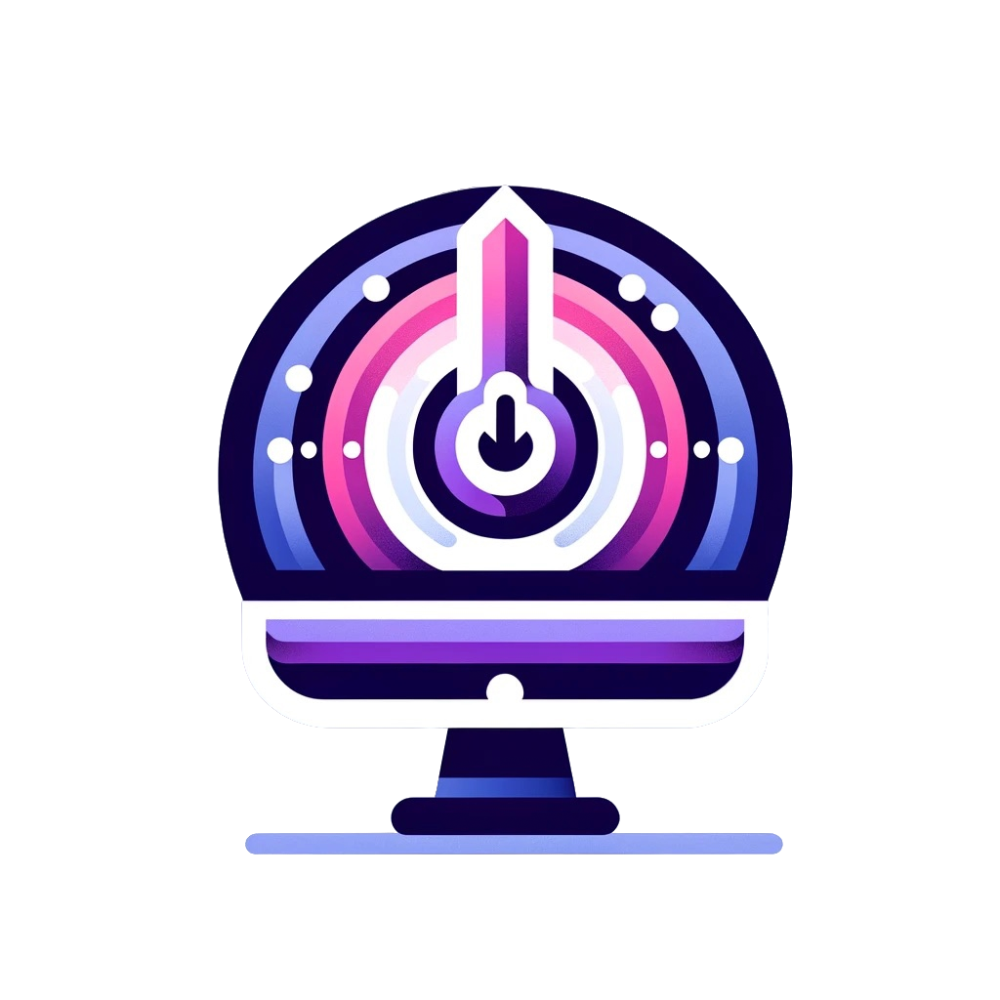
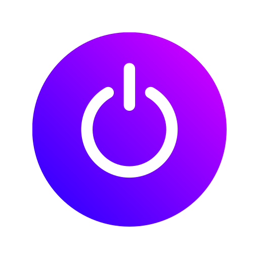

# PowerSparq

# Realizatori si contributii

- **Mihalcea Alexandra**
- Prezentare, Documentatie, Estetica
- **Nita Andrei**
- Programare Front-End & Back-End , SysAdmin

# Documentație Tehnică

Această documentație însoțește proiectul nostru și detaliază componentele care nu au fost realizate integral de către autorii lucrării.

## Componente din proiect

1. **Assets media generate cu ajutorul DALL-E**
   - Toate imaginile și grafica utilizate în proiect au fost generate cu ajutorul DALL-E 2. Acestea includ:
     - 
     - 
     - 
     - 
     - 

2. **Cod folosit la proiect din alte surse**
   - **VNC**
     - Utilizat pentru interactionarea cu desktopul
     ```html
     <!DOCTYPE html>
<html lang="en" class="noVNC_loading">
<head>

    <!--
    noVNC example: simple example using default UI
    Copyright (C) 2019 The noVNC Authors
    noVNC is licensed under the MPL 2.0 (see LICENSE.txt)
    This file is licensed under the 2-Clause BSD license (see LICENSE.txt).

    Connect parameters are provided in query string:
        http://example.com/?host=HOST&port=PORT&encrypt=1
    or the fragment:
        http://example.com/#host=HOST&port=PORT&encrypt=1
    -->
    <title>noVNC</title>

    <link rel="icon" type="image/x-icon" href="app/images/icons/novnc.ico">

    <!-- Apple iOS Safari settings -->
    <meta name="viewport" content="width=device-width, initial-scale=1.0, maximum-scale=1.0, user-scalable=no">
    <meta name="apple-mobile-web-app-capable" content="yes">
    <meta name="apple-mobile-web-app-status-bar-style" content="black-translucent">

    <!-- @2x -->
    <link rel="apple-touch-icon" sizes="40x40" type="image/png" href="app/images/icons/novnc-ios-40.png">
    <link rel="apple-touch-icon" sizes="58x58" type="image/png" href="app/images/icons/novnc-ios-58.png">
    <link rel="apple-touch-icon" sizes="80x80" type="image/png" href="app/images/icons/novnc-ios-80.png">
    <link rel="apple-touch-icon" sizes="120x120" type="image/png" href="app/images/icons/novnc-ios-120.png">
    <link rel="apple-touch-icon" sizes="152x152" type="image/png" href="app/images/icons/novnc-ios-152.png">
    <link rel="apple-touch-icon" sizes="167x167" type="image/png" href="app/images/icons/novnc-ios-167.png">
    <!-- @3x -->
    <link rel="apple-touch-icon" sizes="60x60" type="image/png" href="app/images/icons/novnc-ios-60.png">
    <link rel="apple-touch-icon" sizes="87x87" type="image/png" href="app/images/icons/novnc-ios-87.png">
    <link rel="apple-touch-icon" sizes="120x120" type="image/png" href="app/images/icons/novnc-ios-120.png">
    <link rel="apple-touch-icon" sizes="180x180" type="image/png" href="app/images/icons/novnc-ios-180.png">

    <!-- Stylesheets -->
    <link rel="stylesheet" href="app/styles/base.css">
    <link rel="stylesheet" href="app/styles/input.css">

    <!-- Images that will later appear via CSS -->
    <link rel="preload" as="image" href="app/images/info.svg">
    <link rel="preload" as="image" href="app/images/error.svg">
    <link rel="preload" as="image" href="app/images/warning.svg">

    <script type="module" crossorigin="anonymous" src="app/error-handler.js"></script>
    <script type="module" crossorigin="anonymous" src="app/ui.js"></script>
</head>

<body>

    <div id="noVNC_fallback_error" class="noVNC_center">
        <div>
            <div>noVNC encountered an error:</div>
            <br>
            <div id="noVNC_fallback_errormsg"></div>
        </div>
    </div>

    <!-- noVNC Control Bar -->
    <div id="noVNC_control_bar_anchor" class="noVNC_vcenter">

        <div id="noVNC_control_bar">
            <div id="noVNC_control_bar_handle" title="Hide/Show the control bar"><div></div></div>

            <div class="noVNC_scroll">

            <h1 class="noVNC_logo" translate="no"><span>no</span><br>VNC</h1>

            <hr>

            <!-- Drag/Pan the viewport -->
            <input type="image" alt="Drag" src="app/images/drag.svg"
                id="noVNC_view_drag_button" class="noVNC_button noVNC_hidden"
                title="Move/Drag Viewport">

            <!--noVNC Touch Device only buttons-->
            <div id="noVNC_mobile_buttons">
                <input type="image" alt="Keyboard" src="app/images/keyboard.svg"
                    id="noVNC_keyboard_button" class="noVNC_button" title="Show Keyboard">
            </div>

            <!-- Extra manual keys -->
            <input type="image" alt="Extra keys" src="app/images/toggleextrakeys.svg"
                id="noVNC_toggle_extra_keys_button" class="noVNC_button"
                title="Show Extra Keys">
            <div class="noVNC_vcenter">
            <div id="noVNC_modifiers" class="noVNC_panel">
                <input type="image" alt="Ctrl" src="app/images/ctrl.svg"
                    id="noVNC_toggle_ctrl_button" class="noVNC_button"
                    title="Toggle Ctrl">
                <input type="image" alt="Alt" src="app/images/alt.svg"
                    id="noVNC_toggle_alt_button" class="noVNC_button"
                    title="Toggle Alt">
                <input type="image" alt="Windows" src="app/images/windows.svg"
                    id="noVNC_toggle_windows_button" class="noVNC_button"
                    title="Toggle Windows">
                <input type="image" alt="Tab" src="app/images/tab.svg"
                    id="noVNC_send_tab_button" class="noVNC_button"
                    title="Send Tab">
                <input type="image" alt="Esc" src="app/images/esc.svg"
                    id="noVNC_send_esc_button" class="noVNC_button"
                    title="Send Escape">
                <input type="image" alt="Ctrl+Alt+Del" src="app/images/ctrlaltdel.svg"
                    id="noVNC_send_ctrl_alt_del_button" class="noVNC_button"
                    title="Send Ctrl-Alt-Del">
            </div>
            </div>

            <!-- Shutdown/Reboot -->
            <input type="image" alt="Shutdown/Reboot" src="app/images/power.svg"
                id="noVNC_power_button" class="noVNC_button"
                title="Shutdown/Reboot...">
            <div class="noVNC_vcenter">
            <div id="noVNC_power" class="noVNC_panel">
                <div class="noVNC_heading">
                     Power
                </div>
                <input type="button" id="noVNC_shutdown_button" value="Shutdown">
                <input type="button" id="noVNC_reboot_button" value="Reboot">
                <input type="button" id="noVNC_reset_button" value="Reset">
            </div>
            </div>

            <!-- Clipboard -->
            <input type="image" alt="Clipboard" src="app/images/clipboard.svg"
                id="noVNC_clipboard_button" class="noVNC_button"
                title="Clipboard">
            <div class="noVNC_vcenter">
            <div id="noVNC_clipboard" class="noVNC_panel">
                <div class="noVNC_heading">
                     Clipboard
                </div>
                <p class="noVNC_subheading">
                    Edit clipboard content in the textarea below.
                </p>
                <textarea id="noVNC_clipboard_text" rows=5></textarea>
            </div>
            </div>

            <!-- Toggle fullscreen -->
            <input type="image" alt="Full Screen" src="app/images/fullscreen.svg"
                id="noVNC_fullscreen_button" class="noVNC_button noVNC_hidden"
                title="Full Screen">

            <!-- Settings -->
            <input type="image" alt="Settings" src="app/images/settings.svg"
                id="noVNC_settings_button" class="noVNC_button"
                title="Settings">
            <div class="noVNC_vcenter">
            <div id="noVNC_settings" class="noVNC_panel">
                <div class="noVNC_heading">
                     Settings
                </div>
                <ul>
                    <li>
                        <label><input id="noVNC_setting_shared" type="checkbox"> Shared Mode</label>
                    </li>
                    <li>
                        <label><input id="noVNC_setting_view_only" type="checkbox"> View Only</label>
                    </li>
                    <li><hr></li>
                    <li>
                        <label><input id="noVNC_setting_view_clip" type="checkbox"> Clip to Window</label>
                    </li>
                    <li>
                        <label for="noVNC_setting_resize">Scaling Mode:</label>
                        <select id="noVNC_setting_resize" name="vncResize">
                            <option value="off">None</option>
                            <option value="scale">Local Scaling</option>
                            <option value="remote">Remote Resizing</option>
                        </select>
                    </li>
                    <li><hr></li>
                    <li>
                        <div class="noVNC_expander">Advanced</div>
                        <div><ul>
                            <li>
                                <label for="noVNC_setting_quality">Quality:</label>
                                <input id="noVNC_setting_quality" type="range" min="0" max="9" value="6">
                            </li>
                            <li>
                                <label for="noVNC_setting_compression">Compression level:</label>
                                <input id="noVNC_setting_compression" type="range" min="0" max="9" value="2">
                            </li>
                            <li><hr></li>
                            <li>
                                <label for="noVNC_setting_repeaterID">Repeater ID:</label>
                                <input id="noVNC_setting_repeaterID" type="text" value="">
                            </li>
                            <li>
                                <div class="noVNC_expander">WebSocket</div>
                                <div><ul>
                                    <li>
                                        <label><input id="noVNC_setting_encrypt" type="checkbox"> Encrypt</label>
                                    </li>
                                    <li>
                                        <label for="noVNC_setting_host">Host:</label>
                                        <input id="noVNC_setting_host">
                                    </li>
                                    <li>
                                        <label for="noVNC_setting_port">Port:</label>
                                        <input id="noVNC_setting_port" type="number">
                                    </li>
                                    <li>
                                        <label for="noVNC_setting_path">Path:</label>
                                        <input id="noVNC_setting_path" type="text" value="websockify">
                                    </li>
                                </ul></div>
                            </li>
                            <li><hr></li>
                            <li>
                                <label><input id="noVNC_setting_reconnect" type="checkbox"> Automatic Reconnect</label>
                            </li>
                            <li>
                                <label for="noVNC_setting_reconnect_delay">Reconnect Delay (ms):</label>
                                <input id="noVNC_setting_reconnect_delay" type="number">
                            </li>
                            <li><hr></li>
                            <li>
                                <label><input id="noVNC_setting_show_dot" type="checkbox"> Show Dot when No Cursor</label>
                            </li>
                            <li><hr></li>
                            <!-- Logging selection dropdown -->
                            <li>
                                <label>Logging:
                                    <select id="noVNC_setting_logging" name="vncLogging">
                                    </select>
                                </label>
                            </li>
                        </ul></div>
                    </li>
                    <li class="noVNC_version_separator"><hr></li>
                    <li class="noVNC_version_wrapper">
                        <span>Version:</span>
                        <span class="noVNC_version"></span>
                    </li>
                </ul>
            </div>
            </div>

            <!-- Connection Controls -->
            <input type="image" alt="Disconnect" src="app/images/disconnect.svg"
                id="noVNC_disconnect_button" class="noVNC_button"
                title="Disconnect">

            </div>
        </div>

    </div> <!-- End of noVNC_control_bar -->

    <div id="noVNC_hint_anchor" class="noVNC_vcenter">
        <div id="noVNC_control_bar_hint">
        </div>
    </div>

    <!-- Status Dialog -->
    <div id="noVNC_status"></div>

    <!-- Connect button -->
    <div class="noVNC_center">
        <div id="noVNC_connect_dlg">
            <p class="noVNC_logo" translate="no"><span>no</span>VNC</p>
            <div>
                <button id="noVNC_connect_button">
                     Connect
                </button>
            </div>
        </div>
    </div>

    <!-- Server Key Verification Dialog -->
    <div class="noVNC_center noVNC_connect_layer">
    <div id="noVNC_verify_server_dlg" class="noVNC_panel"><form>
        <div class="noVNC_heading">
            Server identity
        </div>
        <div>
            The server has provided the following identifying information:
        </div>
        <div id="noVNC_fingerprint_block">
            <b>Fingerprint:</b>
            <span id="noVNC_fingerprint"></span>
        </div>
        <div>
            Please verify that the information is correct and press
            "Approve". Otherwise press "Reject".
        </div>
        <div>
            <input id="noVNC_approve_server_button" type="submit" value="Approve" class="noVNC_submit">
            <input id="noVNC_reject_server_button" type="button" value="Reject" class="noVNC_submit">
        </div>
    </form></div>
    </div>

    <!-- Password Dialog -->
    <div class="noVNC_center noVNC_connect_layer">
    <div id="noVNC_credentials_dlg" class="noVNC_panel"><form>
        <div class="noVNC_heading">
            Credentials
        </div>
        <div id="noVNC_username_block">
            <label for="noVNC_username_input">Username:</label>
            <input id="noVNC_username_input">
        </div>
        <div id="noVNC_password_block">
            <label for="noVNC_password_input">Password:</label>
            <input id="noVNC_password_input" type="password">
        </div>
        <div>
            <input id="noVNC_credentials_button" type="submit" value="Send Credentials" class="noVNC_submit">
        </div>
    </form></div>
    </div>

    <!-- Transition Screens -->
    <div id="noVNC_transition">
        <div id="noVNC_transition_text"></div>
        <div>
        <input type="button" id="noVNC_cancel_reconnect_button" value="Cancel" class="noVNC_submit">
        </div>
        <div class="noVNC_spinner"></div>
    </div>

    <!-- This is where the RFB elements will attach -->
    <div id="noVNC_container">
        <!-- Note that Google Chrome on Android doesn't respect any of these,
             html attributes which attempt to disable text suggestions on the
             on-screen keyboard. Let's hope Chrome implements the ime-mode
             style for example -->
        <textarea id="noVNC_keyboardinput" autocapitalize="off"
            autocomplete="off" spellcheck="false" tabindex="-1"></textarea>
    </div>

    <audio id="noVNC_bell">
        <source src="app/sounds/bell.oga" type="audio/ogg">
        <source src="app/sounds/bell.mp3" type="audio/mpeg">
    </audio>
 </body>
</html>
```
- + restul fisierelor din repository-ul novnc

   - **WebSockify**
     - Utilizat pentru schimbul de informatii intre serverul VNC si utilizator
     ```python
     #!/usr/bin/env python

'''
WebSocket server-side load test program. Sends and receives traffic
that has a random payload (length and content) that is checksummed and
given a sequence number. Any errors are reported and counted.
'''

import sys, os, select, random, time, optparse, logging
sys.path.insert(0,os.path.join(os.path.dirname(__file__), ".."))
from websockify.websockifyserver import WebSockifyServer, WebSockifyRequestHandler

class WebSocketLoadServer(WebSockifyServer):

    recv_cnt = 0
    send_cnt = 0

    def __init__(self, *args, **kwargs):
        self.delay = kwargs.pop('delay')

        WebSockifyServer.__init__(self, *args, **kwargs)


class WebSocketLoad(WebSockifyRequestHandler):

    max_packet_size = 10000

    def new_websocket_client(self):
        print "Prepopulating random array"
        self.rand_array = []
        for i in range(0, self.max_packet_size):
            self.rand_array.append(random.randint(0, 9))

        self.errors = 0
        self.send_cnt = 0
        self.recv_cnt = 0

        self.responder(self.request)

        print "accumulated errors:", self.errors
        self.errors = 0

    def responder(self, client):
        c_pend = 0
        cqueue = []
        cpartial = ""
        socks = [client]
        last_send = time.time() * 1000

        while True:
            ins, outs, excepts = select.select(socks, socks, socks, 1)
            if excepts: raise Exception("Socket exception")

            if client in ins:
                frames, closed = self.recv_frames()

                err = self.check(frames)
                if err:
                    self.errors = self.errors + 1
                    print err

                if closed:
                    break

            now = time.time() * 1000
            if client in outs:
                if c_pend:
                    last_send = now
                    c_pend = self.send_frames()
                elif now > (last_send + self.server.delay):
                    last_send = now
                    c_pend = self.send_frames([self.generate()])

    def generate(self):
        length = random.randint(10, self.max_packet_size)
        numlist = self.rand_array[self.max_packet_size-length:]
        # Error in length
        #numlist.append(5)
        chksum = sum(numlist)
        # Error in checksum
        #numlist[0] = 5
        nums = "".join( [str(n) for n in numlist] )
        data = "^%d:%d:%d:%s$" % (self.send_cnt, length, chksum, nums)
        self.send_cnt += 1

        return data


    def check(self, frames):

        err = ""
        for data in frames:
            if data.count('$') > 1:
                raise Exception("Multiple parts within single packet")
            if len(data) == 0:
                self.traffic("_")
                continue

            if data[0] != "^":
                err += "buf did not start with '^'\n"
                continue

            try:
                cnt, length, chksum, nums = data[1:-1].split(':')
                cnt    = int(cnt)
                length = int(length)
                chksum = int(chksum)
            except ValueError:
                print "\n<BOF>" + repr(data) + "<EOF>"
                err += "Invalid data format\n"
                continue

            if self.recv_cnt != cnt:
                err += "Expected count %d but got %d\n" % (self.recv_cnt, cnt)
                self.recv_cnt = cnt + 1
                continue

            self.recv_cnt += 1

            if len(nums) != length:
                err += "Expected length %d but got %d\n" % (length, len(nums))
                continue

            inv = nums.translate(None, "0123456789")
            if inv:
                err += "Invalid characters found: %s\n" % inv
                continue

            real_chksum = 0
            for num in nums:
                real_chksum += int(num)

            if real_chksum != chksum:
                err += "Expected checksum %d but real chksum is %d\n" % (chksum, real_chksum)
        return err


if __name__ == '__main__':
    parser = optparse.OptionParser(usage="%prog [options] listen_port")
    parser.add_option("--verbose", "-v", action="store_true",
            help="verbose messages and per frame traffic")
    parser.add_option("--cert", default="self.pem",
            help="SSL certificate file")
    parser.add_option("--key", default=None,
            help="SSL key file (if separate from cert)")
    parser.add_option("--ssl-only", action="store_true",
            help="disallow non-encrypted connections")
    (opts, args) = parser.parse_args()

    try:
        if len(args) != 1: raise ValueError
        opts.listen_port = int(args[0])

        if len(args) not in [1,2]: raise ValueError
        opts.listen_port = int(args[0])
        if len(args) == 2:
            opts.delay = int(args[1])
        else:
            opts.delay = 10
    except ValueError:
        parser.error("Invalid arguments")

    logging.basicConfig(level=logging.INFO)

    opts.web = "."
    server = WebSocketLoadServer(WebSocketLoad, **opts.__dict__)
    server.start_server()
```
- + restul fisierelor din repository-ul WebSockify

3. **Cod folosit la proiect din alte surse cu modificări aduse de către noi**
   - **style.css login**
     - Modificat pentru a se mula pe cromatica proiectului si pentru a fi adaptat pentru desktop cat si pentru device-uri mobile
   ```css
     @import url('https://fonts.googleapis.com/css?family=Raleway:400,700');

* {
	box-sizing: border-box;
	margin: 0;
	padding: 0;	
	font-family: Raleway, sans-serif;
}

body {
	overflow: hidden;
	background: linear-gradient(90deg, #BD6267, #5B4C97);		
}

.container {
	display: flex;
	align-items: center;
	justify-content: center;
	min-height: 100vh;
}

.screen {		
	background: linear-gradient(90deg, #BD6267, #5B4C97);		
	position: relative;	
	height: 800px;
	width: 480px;	
	box-shadow: 0px 0px 24px #BD6267;
}

.login__input, .login__submit {
    font-size: 30px; 
}

.screen__content {
	z-index: 1;
	position: relative;	
	height: 100%;
}

.screen__background {		
	position: absolute;
	top: 0;
	left: 0;
	right: 0;
	bottom: 0;
	z-index: 0;
	-webkit-clip-path: inset(0 0 0 0);
	clip-path: inset(0 0 0 0);	
}

.screen__background__shape {
	transform: rotate(45deg);
	position: absolute;
}

.screen__background__shape1 {
	height: 520px;
	width: 820px;
	background: #FFF;	
	top: -70px;
	right: 120px;	
	border-radius: 72px 72px 72px 72px;
}

.screen__background__shape2 {
	height: 400px;
	width: 20px;
	background: linear-gradient(270deg, #BD6267, #6A679E);	
	top: -220px;
	right: 0;	
	border-radius: 32px;
}

.screen__background__shape3 {
	height: 540px;
	width: 190px;
	background: linear-gradient(270deg, #BD6267, #6A679E);
	top: -24px;
	right: 0;	
	border-radius: 32px;
}

.screen__background__shape4 {
	height: 700px;
	width: 250px;
	background:linear-gradient(270deg, #BD6267, #6A679E);	
	top: 420px;
	right: 50px;	
	border-radius: 60px;
}

.login {
	width: 440px;
	padding: 40px;
	padding-top: 206px;
}

.login__field {
	padding: 20px 0px;	
	position: relative;	
}

.login__icon {
	position: absolute;
	top: 40px;
	color: #BD6267;
}

.login__input {
	border: none;
	border-bottom: 2px solid #6A679E;
	background: none;
	padding: 10px;
	padding-left: 24px;
	font-weight: 700;
	width: 75%;
	transition: .2s;
}

.login__input:active,
.login__input:focus,
.login__input:hover {
	outline: none;
	border-bottom-color: #6A679E;
}

.login__submit {
	background: #fff;
	font-size: 25px;
	margin-top: 30px;
	padding: 16px 20px;
	border-radius: 26px;
	border: 1px solid #D4D3E8;
	text-transform: uppercase;
	font-weight: 700;
	display: flex;
	align-items: center;
	width: 100%;
	color: #4C489D;
	box-shadow: 0px 2px 2px #5C5696;
	cursor: pointer;
	transition: .2s;
}

.login__submit:active,
.login__submit:focus,
.login__submit:hover {
	border-color: #6A679E;
	outline: none;
}

.button__icon {
	font-size: 24px;
	margin-left: auto;
	color: #BD6267;
}

.social-login {	
	position: absolute;
	height: 140px;
	width: 160px;
	text-align: center;
	bottom: 0px;
	right: 0px;
	color: #fff;
}

.social-icons {
	display: flex;
	align-items: center;
	justify-content: center;
}

.social-login__icon {
	padding: 20px 10px;
	color: #fff;
	text-decoration: none;	
	text-shadow: 0px 0px 8px #7875B5;
}

.social-login__icon:hover {
	transform: scale(1.5);	
}
```
   - **style.css website**
     - Modificat pentru a se mula pe cromatica proiectului
   
   ```css
   /*--------------------------------------------------------------------- 
File Name: style.css 
---------------------------------------------------------------------*/


/*--------------------------------------------------------------------- 
import Fonts
---------------------------------------------------------------------*/

@import url('https://fonts.googleapis.com/css?family=Poppins:100,100i,200,200i,300,300i,400,400i,500,500i,600,600i,700,700i,800,800i,900,900i');
@import url('https://fonts.googleapis.com/css?family=Lato:400,700,700i,900&display=swap');
@import url('https://fonts.googleapis.com/css?family=Roboto:300,400,500,700,900&display=swap');

/*****---------------------------------------- 1)
 2) font-family: 'Poppins', sans-serif;
 ----------------------------------------*****/


/*--------------------------------------------------------------------- 
import Files 
---------------------------------------------------------------------*/

@import url(normalize.css);
/*@import url(icomoon.css);*/
@import url(font-awesome.min.css);
@import url(owl.carousel.min.css);
@import url(nice-select.css);
@font-face {
     font-family: 'helveticaregular';
     src: url('../fonts/helvetica_400-webfont.woff2') format('woff2'), url('../fonts/helvetica_400-webfont.woff') format('woff');
     font-weight: normal;
     font-style: normal;
}


/*--------------------------------------------------------------------- 
basic 
---------------------------------------------------------------------*/

* {
     box-sizing: border-box !important;
}

.container {
     max-width: 1170px;
}

html {
     scroll-behavior: smooth;
}

body {
     color: #666666;
     font-size: 14px;
     font-family: 'Poppins', sans-serif;
     line-height: 1.80857;
     font-weight: normal;
}


/*font-family: 'Roboto', sans-serif;*/

a {
     color: #ffffff;
     text-decoration: none !important;
     outline: none !important;
     -webkit-transition: all .3s ease-in-out;
     -moz-transition: all .3s ease-in-out;
     -ms-transition: all .3s ease-in-out;
     -o-transition: all .3s ease-in-out;
     transition: all .3s ease-in-out;
}
/*culori link uri*/
a:link {
    color: #39bfbf;
  }
  
  /* visited link */
  a:visited {
    color: #39bfbf;
  }
  
  /* mouse over link */
  a:hover {
    color: linear-gradient(270deg, #BD6267, #6A679E);
  }
  
  /* selected link */
  a:active {
    color: linear-gradient(270deg, #BD6267, #6A679E);
  }

h1,
h2,
h3,
h4,
h5,
h6 {
     letter-spacing: 0;
     font-weight: normal;
     position: relative;
     padding: 0;
     font-weight: normal;
     line-height: normal;
     color: #111111;
     margin: 0
}

h1 {
     font-size: 24px;
}

h2 {
     font-size: 22px;
}

h3 {
     font-size: 18px;
}

h4 {
     font-size: 16px
}

h5 {
     font-size: 14px
}

h6 {
     font-size: 13px
}

*,
*::after,
*::before {
     -webkit-box-sizing: border-box;
     -moz-box-sizing: border-box;
     box-sizing: border-box;
}

h1 a,
h2 a,
h3 a,
h4 a,
h5 a,
h6 a {
     color: #212121;
     text-decoration: none!important;
     opacity: 1
}

button:focus {
     outline: none;
}

ul,
li,
ol {
     margin: 0px;
     padding: 0px;
     list-style: none;
}

p {
     margin: 0px;
     font-weight: 500;
     font-size: 15px;
     line-height: 24px;
}

a {
     color: #222222;
     text-decoration: none;
     outline: none !important;
}

a,
.btn {
     text-decoration: none !important;
     outline: none !important;
     -webkit-transition: all .3s ease-in-out;
     -moz-transition: all .3s ease-in-out;
     -ms-transition: all .3s ease-in-out;
     -o-transition: all .3s ease-in-out;
     transition: all .3s ease-in-out;
}

img {
     max-width: 100%;
     height: auto;
}

 :focus {
     outline: 0;
}

.btn-custom {
     margin-top: 20px;
     background-color: transparent !important;
     border: 2px solid #ddd;
     padding: 12px 40px;
     font-size: 16px;
}

.lead {
     font-size: 18px;
     line-height: 30px;
     color: #767676;
     margin: 0;
     padding: 0;
}

.form-control:focus {
     border-color: #ffffff !important;
     box-shadow: 0 0 0 .2rem rgba(255, 255, 255, .25);
}

.navbar-form input {
     border: none !important;
}

.badge {
     font-weight: 500;
}

blockquote {
     margin: 20px 0 20px;
     padding: 30px;
}

button {
     border: 0;
     margin: 0;
     padding: 0;
     cursor: pointer;
}

.full {
     float: left;
     width: 100%;
}

.full {
     width: 100%;
     float: left;
     margin: 0;
     padding: 0;
}


/**-- heading section --**/


/*---------------------------- preloader area ----------------------------*/


.loader_bg {
     position: fixed;
     z-index: 9999999;
     background: linear-gradient(270deg, #BD6267, #6A679E);
     width: 100%;
     height: 100%;
}

.loader {
     height: 100%;
     width: 100%;
     position: absolute;
     left: 0;
     top: 0;
     display: flex;
     justify-content: center;
     align-items: center;
}

.loader img {
     width: 280px;
}

.titlepage {
     text-align: center;
     padding-bottom: 60px;
}

.titlepage h2 {
    text-transform: uppercase;
     font-size: 45px;
     color: #353d47;
     line-height: 50px;
     font-weight: bold;
     padding: 0;
     display: inline-block;
}

.d_flex {
     display: flex;
     align-items: center;
     flex-wrap: wrap;
}

.read_more {
     font-size: 17px;
     background-color: #05254d;
     color: #fff;
    
     width: 100%;
     max-width: 275px;
     text-align: center;
     display: inline-block;
     transition: ease-in all 0.5s;
     font-weight: bold;
     height: 75px;
     text-transform: uppercase;
     line-height: 75px;
}

.read_more:hover {
     background: linear-gradient(270deg, #BD6267, #6A679E);
     color: #fff;
     transition: ease-in all 0.5s;
}

.text_align_left {
     text-align: left;
}

.text_align_right {
     text-align: right;
}

.text_align_center {
     text-align: center;
}


/*-- header --*/

.header-area  {
     padding: 30px 16px;
     color: #f1f1f1;
     width: 100%;
     z-index: 9999999;
     height: 87px;
     background:linear-gradient(270deg,#071b56 , #86183b);
}


.logo_sm {display: none;}


.site-navbar {
    display: flex;
    justify-content: space-between;
    align-items: center;
}

.site-navbar ul {
    margin: 0;
    padding: 0;
    list-style: none;
    display: flex;
}

.site-navbar ul li a {
    color: #000000;
    font-size: 17px;
    display: block;
    text-decoration: none;
    text-transform: uppercase;
}

.site-navbar ul li {
    padding-right: 70px;
}

.site-navbar ul li:last-child {
    padding-right: 0;
}

.site-navbar ul li a:hover {
    color: #00132b;
}
.site-navbar ul li a.active {
    color: #00132b;
}

/* navbar regular css end */


/* nav-toggler css start */

.nav-toggler {
    border: 3px solid #fff;
    padding: 5px;
    background-color: transparent;
    cursor: pointer;
    height: 39px;
    display: none;
    z-index: 99999;
}

.nav-toggler span,
.nav-toggler span:before,
.nav-toggler span:after {
    width: 28px;
    height: 3px;
    background-color: #fff;
    display: block;
    transition: .3s;
}

.nav-toggler span:before {
    content: '';
    transform: translateY(-9px);
}

.nav-toggler span:after {
    content: '';
    transform: translateY(6px);
}

.nav-toggler.toggler-open span {
    background-color: transparent;
}

.nav-toggler.toggler-open span:before {
    transform: translateY(0px) rotate(45deg);
}

.nav-toggler.toggler-open span:after {
    transform: translateY(-3px) rotate(-45deg);
}


/* nav-toggler css start */


/* intro-area css start */

.intro-area {
    height: calc(100vh - 61px);
    display: flex;
    align-items: center;
    text-align: center;
    color: #ffffff;
}


/* intro-area css end */


.left {

    position: absolute;
    background: #00132b;
    width: 80px;
    left: 0;
    height: 87px;
    top: 0;
    text-align: center;
    line-height: 87px;

}

.left  a i {
    color: #fff;

}
.right {
    position: absolute;
    background: #00132b;
    width: 80px;
    right: 0;
    height: 87px;
    top: 0;
    text-align: center;
    line-height: 87px;

}
.right  a i {
    color: #fff;

}
/** end header **/


/** end header **/


/** banner section **/

.full_bg {
     background: url(../images/background.png);
     background-size: cover;
     background-position: center;
     background-repeat: no-repeat;
     height: 100vh;
    padding-bottom: 150px;
     position: relative;
}

.full_bg .carousel-indicators {
    bottom: -43px;
    margin-left: 0;
    left: 20px;
    right: inherit;
    display: none;
}

.full_bg .carousel-indicators li.active {
     display: inline;
}

.full_bg .carousel-indicators li {
     text-indent: unset;
     opacity: 1;
     color: #fff;
     font-size: 18px;
     text-align: center;
     line-height: 59px;
     margin-right: 0px;
     background: transparent; 
     border: none;
     text-indent: unset;
     display: none;
}


.slider_main {
     padding-top: 11%;
}

.cuplle {
     position: inherit;
     bottom: 0;
     padding: 0;
     z-index: 9999;
     left: 0;
     right: 0;
}

.photog {
     z-index: 9999;
     position: relative;
     text-align: left;
}

.photog .read_more:focus {
     box-shadow: none;
}

.photog h1 {
     padding: 0;
     font-size: 89px;
     line-height: 90px;
     color: #fff;
     font-weight: bold;
     text-align: left;
     padding-bottom: 70px;
}


.photog .read_more {
    margin-right: 15px;
    font-weight: normal;
    background:#fff;
    color: #000;
    height: 50px;
    line-height: 50px;
    max-width: 204px;
}


.photog .read_more:hover {background: linear-gradient(270deg, #BD6267, #6A679E); color: #fff;}
.slider_main .carousel-item {
     height: 100%;
     width: 100%;
}

#banner1 .carousel-control-prev,
#banner1 .carousel-control-next {
     width:80px;
     height: 80px;
     background-color: linear-gradient(270deg, #BD6267, #6A679E);
     color: #fff;
     font-size: 35px;
     opacity: 1;
     top: 50%;
     border-radius: 50%;
    
}

#banner1 .carousel-control-prev {
   
      left: 0%;
}

#banner1 .carousel-control-next {
     
     right: 0%;
}

#banner1 .carousel-control-next:focus,
#banner1 .carousel-control-next:hover,
#banner1 .carousel-control-prev:focus,
#banner1 .carousel-control-prev:hover {
     background-color: #fff;
     color: linear-gradient(270deg, #BD6267, #6A679E);
}


/** end banner section **/


/** about section **/

.about {
    background: #fff;
    padding: 80px 50px;
    position: relative;
    margin: 0 70px;
    box-shadow: 3px 0 62px rgba(13, 3, 3, 0.18);
    border-radius: 60px;
    margin-top: -130px;
}

.container_width {max-width: 1380px;
 padding: 0 15px;
 display: block;
 margin: 0 auto;
 clear: both;


}

.about .titlepage {
     padding-bottom: 0;
}
.about .titlepage h2 {
    position: relative;
    padding-bottom: 18px;
}

.about .titlepage h2::before {
    position: absolute;
    content: "";
    bottom: 0px;
    background: linear-gradient(270deg, #BD6267, #6A679E);
    width: 93px;
    height: 11px;
    left: 0;
    border-radius: 20px;
}
.about .titlepage p {
    font-weight: normal;
    font-size: 17px;
    line-height: 30px;
    color: #111111;
    padding: 35px 0px 50px 0px;
}


.about_img figure {
     margin: 0;
}

/** end about section **/


/** coronata section **/

.coronata {
    background: #fff;
   padding-top: 100px;
  
}

.coronata .titlepage {
     padding-bottom: 0;
}

.coronata .titlepage p {
    font-weight: normal;
    font-size: 17px;
    line-height: 30px;
    color: #111111;
    padding: 35px 0px 50px 0px;
}


.coronata_img figure {
     margin: 0;
}

/** end coronata section **/


/** protect **/

.protect {
    padding: 0 30px;
     padding-top: 80px;
    padding-bottom: 25px;
}


.protect_bg  {
       background:url(../images/project.png);
     background-repeat: no-repeat;
     background-position: center;
     background-size: 100% 100%;
       padding-top: 80px;
      padding-bottom: 48px;
}

.protect .titlepage p {
     padding-top: 5px;
   
}
.desktop {
    padding: 45px 20px 30px 20px;
    background: #fff;
    border-radius: 20px;
}


.protect_box h3 {
     color: #0d0e0e;
     font-size: 17px;
     font-weight: bold;
     padding-top: 25px;
     padding-bottom: 5px;
 
}

.protect_box span {
     color: #081419;
     font-weight:normal;
}
.protect .read_more {
    margin: 0 auto;
    display: block;
    max-width: 174px;
    height: 51px;
    line-height: 51px;
    font-weight: bold;
    font-size: 15px !important;
    margin-top: 40px;

}
.owl-carousel .owl-item img {
    width: inherit !important;
    text-align: center;
    margin: 0 auto;
    height: 90px;
}

.owl-carousel .owl-nav.disabled {
     display: inherit !important;
    padding-top: 80px;
}


.owl-carousel .owl-nav button.owl-next, 
.owl-carousel .owl-nav button.owl-prev {
     width: 90px;
     height: 90px;
     background-color: linear-gradient(270deg, #BD6267, #6A679E) !important;
     color: #fff !important;
     font-size: 55px !important;
     line-height: 30px !important;
     opacity: 1;
     border-radius: 50px;
     transition: ease-in all 0.5s;
     box-shadow: 0 0 80px rgba(13, 3, 3, 0.11);
}
.owl-carousel .owl-nav button.owl-next:hover, 
.owl-carousel .owl-nav button.owl-prev:hover {
     background-color: #fff !important;
     transition: ease-in all 0.5s;
     color: #000 !important;
}
.owl-next {
    position: absolute;
    right: 42%;
}
.owl-prev {
    position: absolute;
    left: 42%;
}


/** end protect **/


/** cases section **/

.cases {
    background: #fff;
    padding: 0 30px 0 30px;
   padding-top: 70px;


}
.cases .titlepage {padding-bottom: 30px;}
.cases .titlepage p {padding-top: 5px;}
.latest {
    margin-top: 30px;
    background: #fff;
    padding: 25px 25px 0px 25px;
    box-shadow: 3px 0 62px rgba(13, 3, 3, 0.20);
    margin-bottom: 70px;
}


.latest figure {margin: 0;}

.latest .read_more {
    margin: 0 auto;
    display: block;
    position: absolute;
    z-index: 99999;
    max-width: 174px;
    height: 51px;
    line-height: 51px;
    font-weight: normal;
    top: 22%;
    right: 0;
    left: 0;
    bottom: 0;
}

.nostrud h3 {
    color: #151515;
    font-size: 30px;
    line-height: 30px;
    font-weight: bold;
    padding-top: 52px;
}

.nostrud p {
    padding: 5px 0 60px 0;
    color: #0f100d;
    line-height: 28px;
    font-weight: normal;
}

.nostrud {position:relative;}
.nostrud::before {
    position: absolute;
    content: "";
    left: 0;
    right: 0;
    background: url();
    bottom: -40px;
    width: 80px;
    height: 81px;
    text-align: center;
    margin: 0 auto;
}


/** end cases section **/


/** doctors section **/

.doctors {
    background: #fff;
   
   padding-top: 50px;
   position: relative;


}


.reader {
    margin-top: 45px;
    background: #fff;
    padding: 0px 30px 60px 30px;
    box-shadow: 3px 0 62px rgba(13, 3, 3, 0.20);
    border-radius: 10px;
     transition: ease-in all 0.5s;
     margin-bottom: 30px;
}


.reader i {
    margin: 0;
}

.reader i img {
   border-radius: 50%;  
       box-shadow: 3px 0 62px rgba(13, 3, 3, 0.18);  margin-top: -50px;  
}


.reader h3 {
    color: #151515;
    font-size: 20px;
    line-height: 20px;
    font-weight: bold;
    padding-top: 42px;
    text-transform: uppercase;
}

.reader p {
    padding: 20px 0 40px 0;
    color: #0f100d;
    line-height: 28px;
    font-weight: normal;
}

#ho_efcet:hover .reader {background: #fafaf9;  transition: ease-in all 0.5s;}


.doctors::before {
    position: absolute;
    content: "";
    right: 4%;
    background: url(../images/case.png);
    top: 34%;
    width: 120px;
    height: 121px;
}

/** end doctors section **/


/** contact **/

.contact {
    background: #fff;
    padding-top: 50px;
}


.contact .titlepage {padding-bottom: 0;}
.main_form {padding-top:45px;}
.main_form .contactus {
     padding: 0px 20px;
     margin-bottom: 25px;
     width: 100%;
     height: 66px;
     background: #fff;
     color: #a3a3a2;
     font-size: 17px;
     font-weight: normal;
     border: #9d9d9c solid 2px;
}

.main_form .textarea {
     margin-bottom: 30px;
     width: 100%;
     background: #fff;
     color: #a3a3a2;
     font-size: 17px;
     font-weight: normal;
     padding: 40px 20px 10px 20px;
     border: #9d9d9c solid 2px;
     height: 120px;
}

.main_form .send_btn {
     font-size: 15px;
     transition: ease-in all 0.5s;
     background-color: #2b2b2b;
     text-transform: uppercase;
     color: #fff;
     max-width: 200px;
     width: 100%;
     display: block;
     font-weight: bold;
     height: 77px;
     line-height: 77px;
}

.main_form .send_btn:hover {
     background-color: linear-gradient(270deg, #BD6267, #6A679E);
     transition: ease-in all 0.5s;
     color: #fff;
}

#request *::placeholder {
     color: #a3a3a2;
     opacity: 1;
}


/** end contact **/


/** update **/

.update { padding-top: 50px; position: relative;}


.update::before {
    position: absolute;
    content: "";
    left: 4%;
    background: url(../images/logo.png);
    top: 3%;
    width: 120px;
    height: 121px;
    background-repeat: no-repeat;
}
.cevery_white {background: #fff;}
.cevery_bg {background: url(../images/ever_bg.jpg);
background-size: cover;
background-repeat: no-repeat; background-position: center;
padding: 80px 0;
}


.newsl {
    text-transform: uppercase;
    width: 100%;
    height: 87px;
    background: transparent;
    color: #fff;
    font-size: 17px;
    font-weight: normal;
    box-shadow: inherit;
    padding: 0 25px;
    border: #fff solid 1px;
    border-radius: 50px;

}

.subsci_btn {

    font-size: 21px;
    transition: ease-in all 0.5s;
    text-transform: uppercase;
    color: #fff;
    font-weight: bold;
    line-height: 82px;
    height: 82px;
    max-width: 402px;
    width: 100%;
    display: block;
    border: inherit;
    background: #0a264a;
    border-radius: 50px;
    margin: 0 auto;
    margin-top: 30px;

}

.subsci_btn:hover {
    transition: ease-in all 0.5s;
    color: #fff;
    background-color: linear-gradient(270deg, #BD6267, #6A679E);
}

#colof *::placeholder {
    color: #fff;
    opacity: 1;
}
/** end update **/


/** footer **/

.footer {
    padding-top: 80px;
    background: #111111;
    text-align: center;
}

.hedingh3 {padding-bottom: 25px;}
.hedingh3 h3 {
    color: #fff;
    font-size: 20px;
    padding-bottom: 20px;
    line-height: 23px;
    font-weight: bold;
    text-align: left;
    text-transform: uppercase;
}

.hedingh3 p {
    color: #fff;
    text-align: left;
    margin-bottom: 15px;
}

ul.menu_footer {
    text-align: left;
    margin-bottom: 15px;
}

ul.menu_footer li a {
    color: #979793;
    font-size: 17px;
    line-height: 18px;
    padding-bottom: 10px;
    display: block;
}

ul.menu_footer li a:hover {
    color: linear-gradient(270deg, #BD6267, #6A679E);
}


ul.inst li {
    display: inline-block;
    margin: 4px;
}


ul.top_infomation li {
    display: block;
    font-size: 17px;
    color: #fff;
}

ul.top_infomation li:last-child {
    padding-right: 0;
}

ul.top_infomation li i {
    margin-right: 5px;
    color: #fff;
    text-align: center;
    transition: ease-in all 0.5s;
}

ul.top_infomation li a {
    color: #fff;
}

ul.top_infomation li a:hover {
    color: linear-gradient(270deg, #BD6267, #6A679E);
}

ul.top_infomation li i:hover {
    background: #eb4746;
    color: #fff;
    border-radius: 25px;
    cursor: pointer;
    transition: ease-in all 0.5s;
}


.copyright {
    margin-top: 60px;
   
    padding-bottom: 20px;
}

.copyright p {
    border-top:#d1d1d1 solid 1px;
    padding-top: 20px;
    color: #d1d1d1;
    font-size: 17px;
    line-height: 22px;
    text-align: center;
    font-weight: normal;
}

.copyright a {
    color: #d1d1d1;
}

.copyright a:hover {
    color: linear-gradient(270deg, #BD6267, #6A679E);
}


/** end footer **/


/**  inner page css **/


.inner_page .full_bg {
     height: 106px;
     padding-bottom: 0;
    
}
.inner_page .about {
    margin-top: 145px;
    margin-bottom: 80px;
}

.inner_page .doctors { padding-top: 140px;  padding-bottom: 50px;}
.inner_page .coronata {
    padding-top: 130px;
    padding-bottom: 80px;
}
.inner_page .cases {padding-top: 140px;
padding-bottom: 40px;}
.inner_page .contact {
    padding-top: 145px;
    padding-bottom: 80px;
}
```
+ alte fisiere apelate de aceasta ( boostrap , font-awsome etc.)
## Concluzie

- **Java Script-ul utilizat de site**
     - Utilizat pentru meniuri si animatii
     ```js
     /*---------------------------------------------------------------------
    File Name: custom.js
---------------------------------------------------------------------*/

$(function () {
	
	"use strict";
	
	/* Preloader
	-- -- -- -- -- -- -- -- -- -- -- -- -- -- -- -- -- -- -- -- -- -- -- -- */
	
	setTimeout(function () {
		$('.loader_bg').fadeToggle();
	}, 1500);
	
	/* Tooltip
	-- -- -- -- -- -- -- -- -- -- -- -- -- -- -- -- -- -- -- -- -- -- -- -- */
	
	$(document).ready(function(){
		$('[data-toggle="tooltip"]').tooltip();
	});
	
	
	
	/* Mouseover
	-- -- -- -- -- -- -- -- -- -- -- -- -- -- -- -- -- -- -- -- -- -- -- -- */
	
	$(document).ready(function(){
		$(".main-menu ul li.megamenu").mouseover(function(){
			if (!$(this).parent().hasClass("#wrapper")){
			$("#wrapper").addClass('overlay');
			}
		});
		$(".main-menu ul li.megamenu").mouseleave(function(){
			$("#wrapper").removeClass('overlay');
		});
	});
	
	
	

	
	
	/* Toggle sidebar
	-- -- -- -- -- -- -- -- -- -- -- -- -- -- -- -- -- -- -- -- -- -- -- -- */
     
     $(document).ready(function () {
       $('#sidebarCollapse').on('click', function () {
          $('#sidebar').toggleClass('active');
          $(this).toggleClass('active');
       });
     });

     /* Product slider 
     -- -- -- -- -- -- -- -- -- -- -- -- -- -- -- -- -- -- -- -- -- -- -- -- */
     // optional
     $('#blogCarousel').carousel({
        interval: 5000
     });


});

/* Toggle sidebar
     -- -- -- -- -- -- -- -- -- -- -- -- -- -- -- -- -- -- -- -- -- -- -- -- */
function openNav() {
  document.getElementById("mySidepanel").style.width = "250px";
}

function closeNav() {
  document.getElementById("mySidepanel").style.width = "0";
}


/* Animate js*/

(function($) {
  //Function to animate slider captions
  function doAnimations(elems) {
    //Cache the animationend event in a variable
    var animEndEv = "webkitAnimationEnd animationend";

    elems.each(function() {
      var $this = $(this),
        $animationType = $this.data("animation");
      $this.addClass($animationType).one(animEndEv, function() {
        $this.removeClass($animationType);
      });
    });
  }

  //Variables on page load
  var $myCarousel = $("#carouselExampleIndicators"),
    $firstAnimatingElems = $myCarousel
      .find(".carousel-item:first")
      .find("[data-animation ^= 'animated']");

  //Initialize carousel
  $myCarousel.carousel();

  //Animate captions in first slide on page load
  doAnimations($firstAnimatingElems);

  //Other slides to be animated on carousel slide event
  $myCarousel.on("slide.bs.carousel", function(e) {
    var $animatingElems = $(e.relatedTarget).find(
      "[data-animation ^= 'animated']"
    );
    doAnimations($animatingElems);
  });
})(jQuery);

/* Toggle sidebar
     -- -- -- -- -- -- -- -- -- -- -- -- -- -- -- -- -- -- -- -- -- -- -- -- */
function openNav() {
  document.getElementById("mySidepanel").style.width = "250px";
}

function closeNav() {
  document.getElementById("mySidepanel").style.width = "0";
}


// owl-carousel
$('.owl-carousel').owlCarousel({
  loop: true,
  margin: 15,
  nav: true,

  responsive: {
    0: {
      items: 1
    },
    600: {
      items: 3
    },
    1000: {
      items: 3
    }
  }
})


// menu js

// define all UI variable
const navToggler = document.querySelector('.nav-toggler');
const navMenu = document.querySelector('.site-navbar ul');
const navLinks = document.querySelectorAll('.site-navbar a');

// load all event listners
allEventListners();

// functions of all event listners
function allEventListners() {
  // toggler icon click event
  navToggler.addEventListener('click', togglerClick);
  // nav links click event
  navLinks.forEach( elem => elem.addEventListener('click', navLinkClick));
}

// togglerClick function
function togglerClick() {
  navToggler.classList.toggle('toggler-open');
  navMenu.classList.toggle('open');
}

// navLinkClick function
function navLinkClick() {
  if(navMenu.classList.contains('open')) {
    navToggler.click();
  }
}
```
- **Script PHP**
     - Utilizat si adaptat pentru verificarea si redirectarea userilor de pe o pagina pe alta a site-ului in urma verificarii acestora in baza de date MySql
```php
<?php
// Start a new session
session_start();

// Datele pentru conectarea la baza de date
$host = 'localhost'; // sau adresa IP a serverului de baze de date
$dbUsername = 'xfoflart_andrei'; // Utilizatorul bazei de date
$dbPassword = 'powersparq2024'; // Parola bazei de date
$dbName = 'xfoflart_powersparq'; // Numele bazei de date

// Crearea conexiunii la baza de date
$conn = new mysqli($host, $dbUsername, $dbPassword, $dbName);

// Verifică conexiunea
if ($conn->connect_error) {
    die("Conexiunea a eșuat: " . $conn->connect_error);
}

// Preia username și password din POST
$username = $_POST['username'];
$password = $_POST['password'];

// Prevenirea SQL injection
$username = $conn->real_escape_string($username);
$query = "SELECT * FROM users WHERE username = '$username'";

$result = $conn->query($query);

if ($result->num_rows > 0) {
    $row = $result->fetch_assoc();
    // Verifică dacă parola se potrivește
    if (password_verify($password, $row['password'])) {
        // Parola se potrivește, inițiază sesiunea și redirecționează utilizatorul
        $_SESSION['loggedin'] = true;
        $_SESSION['username'] = $username;
        // Redirecționează către folderul specific
        header("Location: /wakeonlan/interfata/");
        exit;
    }
} else {
    // Utilizatorul nu există, redirecționează către error.html
    header("Location: error.html");
    exit;
}

$conn->close();
?>
```


